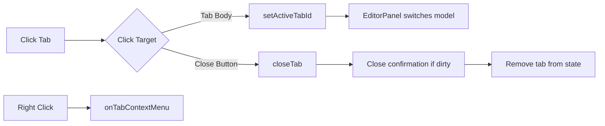

The `TabsBar` component displays open file tabs with visual indicators for active state, dirty (unsaved) changes, and provides tab switching and closing functionality.

## Overview

The TabsBar component:

- Displays all open file tabs horizontally
- Shows active tab with visual highlighting
- Indicates unsaved changes with a dirty marker
- Supports tab switching via click
- Allows closing tabs via close button
- Provides right-click context menu for tab operations

## Props

```typescript
interface TabsBarProps {
  onTabContextMenu: (x: number, y: number, tabId: number) => void;
}
```

<ParamField path="onTabContextMenu" type="function" required>
  Callback for showing tab context menu on right-click
  
  **Parameters:**
  - `x: number` - Mouse X position
  - `y: number` - Mouse Y position
  - `tabId: number` - ID of the tab that was right-clicked
</ParamField>

## Component structure

```typescript
export default function TabsBar({ onTabContextMenu }: TabsBarProps)
```

## Context dependencies

The component uses the following from `EditorContext`:

<ParamField path="tabs" type="TabState[]">
  Array of all open tabs
</ParamField>

<ParamField path="activeTabId" type="number | null">
  ID of the currently active tab
</ParamField>

<ParamField path="setActiveTabId" type="(id: number | null) => void">
  Function to switch to a different tab
</ParamField>

<ParamField path="closeTab" type="(id: number) => void">
  Function to close a tab
</ParamField>

## Features

### Tab rendering

Each tab displays:

- **File icon**: Generic file SVG icon
- **Tab name**: File name (from `tab.name`)
- **Dirty indicator**: Bullet point (●) when `tab.dirty === true`
- **Close button**: X icon for closing the tab

```tsx
<div className={`tab ${tab.id === activeTabId ? 'active' : ''}`}>
  <svg className="tab-icon">...</svg>
  <span className="tab-name" title={tab.path ?? tab.name}>
    {tab.name}
  </span>
  {tab.dirty && <span className="tab-dirty">●</span>}
  <span className="tab-close" data-closeid={tab.id}>
    <svg>...</svg>
  </span>
</div>
```

### Tab switching

Clicking a tab activates it:

```typescript
onClick={(e) => {
  const closeid = (e.target as HTMLElement).closest('[data-closeid]');
  if (closeid) {
    // User clicked close button
    closeTab(parseInt(closeid.getAttribute('data-closeid')!));
    return;
  }
  setActiveTabId(tab.id);
}}
```

### Close button handling

The close button is detected using a `data-closeid` attribute:

```tsx
<span className="tab-close" data-closeid={tab.id}>
  <svg width="10" height="10" viewBox="0 0 10 10">
    <line x1="1.5" y1="1.5" x2="8.5" y2="8.5" />
    <line x1="8.5" y1="1.5" x2="1.5" y2="8.5" />
  </svg>
</span>
```

When clicked, it calls `closeTab()` instead of switching tabs.

### Context menu

Right-clicking a tab shows a context menu:

```typescript
onContextMenu={(e) => {
  e.preventDefault();
  onTabContextMenu(e.clientX, e.clientY, tab.id);
}}
```

Typical context menu options include:
- Close
- Close Others
- Close All
- Close to the Right
- Reveal in Explorer

### Visual states

Tabs have three visual states:

1. **Normal**: Default appearance
2. **Active**: Highlighted with `.active` class when `tab.id === activeTabId`
3. **Dirty**: Shows bullet marker when `tab.dirty === true`

## Tab structure

Each tab object contains:

```typescript
interface TabState {
  id: number;              // Unique tab identifier
  name: string;            // Display name (filename)
  path: string | null;     // Full file path or null for untitled
  model: ITextModel | null; // Monaco editor model
  dirty: boolean;          // Has unsaved changes
  cursor?: { lineNumber: number; column: number }; // Cursor position
  scroll?: number;         // Scroll position
  viewState?: ICodeEditorViewState | null; // Monaco view state
}
```

## Usage example

```tsx
import TabsBar from './components/TabsBar';
import { useState } from 'react';

function App() {
  const [contextMenu, setContextMenu] = useState<{
    x: number;
    y: number;
    tabId: number;
  } | null>(null);
  
  const handleTabContextMenu = (x: number, y: number, tabId: number) => {
    setContextMenu({ x, y, tabId });
  };
  
  return (
    <>
      <TabsBar onTabContextMenu={handleTabContextMenu} />
      {contextMenu && (
        <TabContextMenu
          x={contextMenu.x}
          y={contextMenu.y}
          tabId={contextMenu.tabId}
          onClose={() => setContextMenu(null)}
        />
      )}
    </>
  );
}
```

## Styling classes

- `.tabs-bar` - Container for the entire tab bar
- `.tabs-list` - Horizontal list of tabs
- `.tab` - Individual tab element
- `.tab.active` - Active tab highlight
- `.tab-icon` - File icon SVG
- `.tab-name` - File name text
- `.tab-dirty` - Dirty indicator (●)
- `.tab-close` - Close button container

## Interaction flow



## Related components

- [EditorPanel](/components/editor-panel) - Displays content of active tab
- [StatusBar](/components/status-bar) - Shows active tab info
- [Component overview](/components/overview) - Architecture and state management

<Note>
  The TabsBar component is purely presentational. All tab state management is handled by `EditorContext`, which ensures consistency across the application.
</Note>

<Note>
  Tabs are never directly manipulated. Always use context methods like `createTab()`, `closeTab()`, and `setActiveTabId()` to ensure proper model lifecycle management.
</Note>
